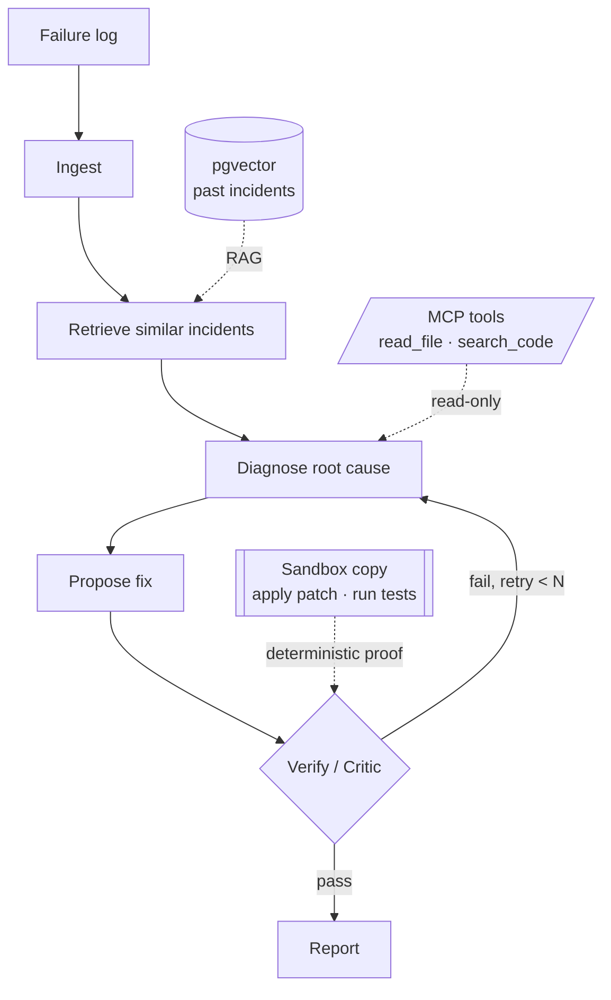

# Sherlog

**Multi-agent log diagnosis: finds root cause, proposes fixes, and self-verifies.**


*Diagnosing a real bug: the agent reads the source, proposes a structured patch, and the
verifier applies it to a sandbox copy and runs the tests — a green test, not an opinion.
(Recording sped up ~2×.)*

Sherlog is a multi-agent fault-diagnosis tool built on [LangGraph](https://langchain-ai.github.io/langgraph/). It ingests a failure log, retrieves similar historical incidents and code context via RAG (pgvector), hypothesizes the root cause, proposes a fix, and runs a **self-correction loop** where a Critic agent validates the result and feeds back until the diagnosis holds. It ships with rigorous evaluation (RAGAS / DeepEval) so accuracy is reported with real numbers, not just a demo.

> Status: early development. End-to-end pipeline (ingest → RAG retrieve → diagnose → propose fix → self-correct → report) runs today, including MCP tool-use and an eval harness. Rigorous accuracy numbers on a hardened eval set are in progress.

## Architecture



- **Retrieve** grounds the diagnosis in similar past incidents (pgvector RAG).
- **Diagnose** reads the actual code through **read-only** MCP tools.
- The **gate** is either an LLM critic (opinion) or — given a target repo + test command —
  a **deterministic verifier** that applies the fix to a sandbox copy and runs the tests.
- A bounded self-correction loop feeds failures back to the diagnostician with the reason.

## Tech stack

LangGraph · Claude (Anthropic) · pgvector · RAGAS / DeepEval · MCP · Python 3.11+

## Results

Measured on `claude-sonnet-4-6`. These evals are designed to test value that
**does not depend on using a weak model** — the gains hold on a strong one.

**Grounded gain — does reading the code help?** On 12 *code-rooted* cases (failure
logs that show only a symptom, with the real cause in the code), diagnosis was run
two ways on the same model, self-correction off:

| Diagnosis mode | Root-cause accuracy |
|---|---|
| Log-only | 83% |
| Tool-augmented (reads the code via MCP) | **100%** |
| **Grounded gain** | **+17%** |

Tool-augmented diagnosis was correct on *every* case; log-only failed exactly where the
assertion alone gives no usable clue (e.g. `assert True is False` from a wrong boolean
operator). A strong model infers many code bugs from the symptom — the gain is the
slice where it genuinely can't.

**Verification vs. opinion — how reliable is the gate?** On a 14-fix gate benchmark
(correct + plausible-but-wrong fixes, 5 of them broken), scored against whether the
test actually passes:

| Gate | Accuracy vs. ground truth |
|---|---|
| LLM critic (reasons about the fix) | 93% |
| Deterministic verifier (applies it, runs the tests) | **100%** |

The verifier caught all 5 broken fixes. The critic's single miss is instructive: it
*rejected* a `round()` fix that float intuition says is broken but actually passes —
only running the test settles it. Opinion is good; proof is exact.

Reproduce: `uv run python -m sherlog.eval.run_grounded` and `... .run_gates`.

## Quickstart

```bash
# 1. Install dependencies (uses uv)
uv sync

# 2. Configure your Claude API key
cp .env.example .env
# then edit .env and set ANTHROPIC_API_KEY

# 3. Start the pgvector database (needed from P2 onward)
docker compose up -d

# 4. Diagnose a failure log (log-only reasoning)
uv run sherlog diagnose data/samples/npm_build_failure.log
# ...or pipe one in:
cat build.log | uv run sherlog diagnose

# 5. Diagnose WITH tool access — the agent reads the project's code (via MCP)
#    instead of reasoning from the log alone:
uv run sherlog diagnose examples/buggy_calculator/failure.log \
  --target-dir examples/buggy_calculator

# 6. ...and PROVE the fix — apply it to a throwaway copy and run the tests:
uv run sherlog diagnose examples/buggy_calculator/failure.log \
  --target-dir examples/buggy_calculator \
  --test-command "python -m pytest -q"
```

That last command produces (abridged):

```markdown
# Sherlog Diagnosis

## Root Cause
`apply_discount` subtracts the raw `pct` value as a flat amount instead of treating it
as a percentage. `apply_discount(100, 0.1)` computes `100 - 0.1 = 99.9` instead of 90.
Evidence: calculator.py line 11 — `return price - pct`.

## Proposed Fix
--- calculator.py ---
- return price - pct
+ return price * (1 - pct)

## Verification
Status: ✅ accepted after 1 iteration.
PASS — the fix was applied and the tests passed.  (exit_code=0, 1 passed)
```

The diagnosis is grounded in the actual source, and the fix is **proven** by an
isolated test run — the original project is never modified.

### MCP tools

When `--target-dir` is set, the agents investigate the project through an MCP server
(`sherlog.mcp_server`) exposing three tools, sandboxed to that directory:

| Tool | What it does |
|------|--------------|
| `read_file` | Read a source file the stack trace points at |
| `search_code` | Regex-grep the project for a symbol or message |
| `run_command` | Run a command (used only by the verifier, on a copy) |

Diagnosis and fix-proposal use the **read-only** tools, so investigation can never
mutate the project.

### Deterministic verification (proof, not opinion)

With `--test-command`, the gate stops being an LLM judgment. The fix proposer emits a
**structured patch** (`file` / `old` / `new`); the verifier copies the project to a
temp sandbox, applies the patch, and runs your test command. The verdict is the test's
real exit code. If it still fails, the loop retries with that feedback. The original
project is never modified.

## Security

Sherlog can point an LLM at a real codebase, so the tool surface is designed for
**least privilege** and **isolated side effects**:

- **Read-only investigation.** The diagnosis and fix-proposal agents get only
  `read_file` and `search_code`. They can inspect the project but cannot modify it or
  execute commands — an agent can never edit the code it is diagnosing.
- **Side effects only in a sandbox.** The single tool that runs commands is used only
  by the deterministic verifier, and only against a **throwaway copy** of the project
  (`copytree` → apply patch → run tests → delete). The original is never the working
  directory.
- **Path confinement.** All file access is resolved under the target directory; path
  traversal (e.g. `../../etc/passwd`) is rejected.
- **Bounded loops.** Self-correction is capped by `SHERLOG_MAX_ITERATIONS` so a run
  always terminates.

These invariants are covered by tests (e.g. the original project is asserted to be
byte-for-byte unchanged after a verification run).

## Development

```bash
uv run pytest        # run tests
uv run ruff check .  # lint
```

## License

MIT — see [LICENSE](LICENSE).
